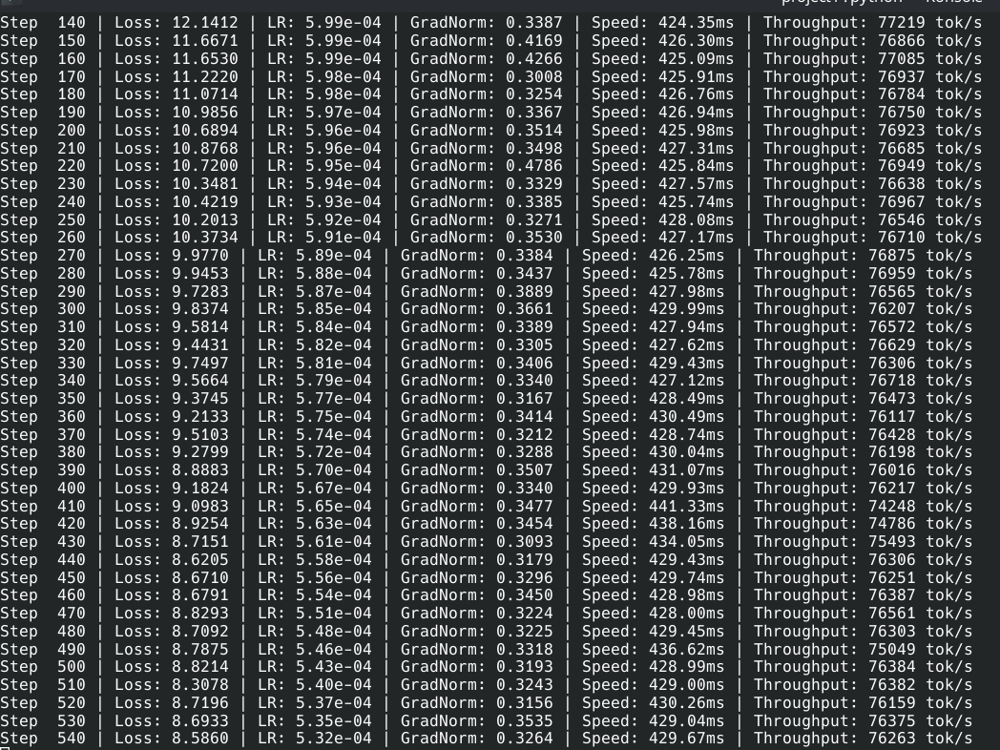
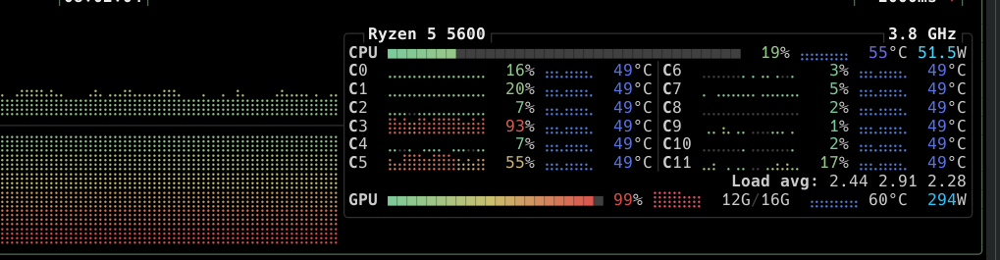
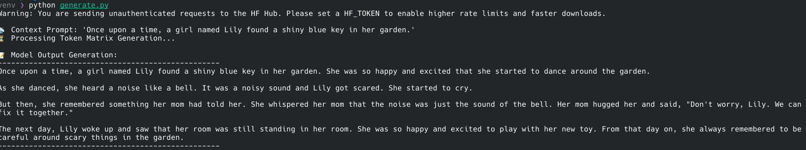

# High-Throughput Custom LLaMA Inference & Training Engine (GQA + RoPE)

A production-grade, bare-metal LLaMA-style autoregressive transformer architecture written completely from scratch in PyTorch. The engine is deliberately engineered to optimize hardware saturation and memory efficiency on consumer-grade accelerators, deploying native support for AMD/ROCm and NVIDIA/CUDA environments.

## ⚡ Hardware Telemetry & Performance Metrics
* **Training Throughput:** Peak saturation at **~76,000 to 77,000 tokens per second**.

* **Convergence Latency:** Complete optimization pass over the training split completed in **14.6 minutes**.
* **VRAM Allocation Efficiency:** Aggressively constrained to **12.2 GB / 16GB** maximum allocation using dynamically grouped matrix math and micro-batched gradient accumulation loops.

* **Target Hardware Context:** Executed natively inside an **AMD ROCm** Linux subsystem utilizing explicitly targeted `sdpa_kernel` execution paths to completely avoid high-latency host framework fallbacks.

## 🏗️ Low-Level Systems Optimizations Implemented

1. **Grouped-Query Attention (GQA):** Implemented asymmetric projection matrices (mapping 12 Query heads down to 4 shared Key/Value head groups) to drastically minimize KV Cache memory bandwidth overhead—the primary bottleneck in modern autoregressive sequence processing.
2. **Rotary Position Embeddings (RoPE):** Avoided legacy absolute or learned positional vectors by constructing inline 2D complex-space tensor rotations, allowing the model to naturally infer relative token distances with clean sequence generalization.
3. **Vocab Tensor Core Sizing Alignment:** Padded the traditional token vector catalog from `50,257` to `50,304` (the next immediate multiple of 128). This alignment optimization allows the final vocabulary projection matrix to feed execution pipelines concurrently without structural memory misalignment penalties.
4. **Zero-Copy Memory Mapped Dataloader:** Built a high-velocity input stream bypassing regular Python storage wrappers via `np.memmap`. Combined with host allocation pinning (`pin_memory()`), this allows the host CPU to stream binary blocks to the GPU asynchronously over PCIe, eliminating storage I/O training bubbles.

---

## 🔬 Core Repository Structure

* `architecture.py` — The primary structural module containing `RMSNorm`, `SwiGLU` activation layers, `RotaryEmbedding` calculations, and the `LLaMABase` wrapper.
* `tokenize_data.py` — High-speed tokenization and serialization pipeline packing raw data chunks into tight `uint16` binary sequence blocks.
* `dataloader.py` — High-performance zero-copy memory-mapped asynchronous tensor pipeline.
* `train.py` — Master optimization script executing Cosine Decay learning rate schedules with linear warmup.
* `generate.py` — Creative auto-regressive decoding script utilizing Top-K filtration and temperature scaling.

---

## 📈 Optimization & Qualitative Output Verification

The network was trained using the **TinyStories framework** (synthetic corpus optimized for syntactic precision and structural clarity). 

### Sample Generation Checkpoint
**Prompt:** *'Once upon a time, a girl named Lily found a shiny blue key in her garden.'*


```text
Once upon a time, a girl named Lily found a shiny blue key in her garden. She was so happy and excited that she started to dance around the garden.

As she danced, she heard a noise like a bell. It was a noisy sound and Lily got scared. She started to cry.

But then, she remembered something her mom had told her. She whispered her mom that the noise was just the sound of the bell. Her mom hugged her and said, "Don't worry, Lily. We can fix it together."
```
References: https://huggingface.co/datasets/roneneldan/TinyStories
